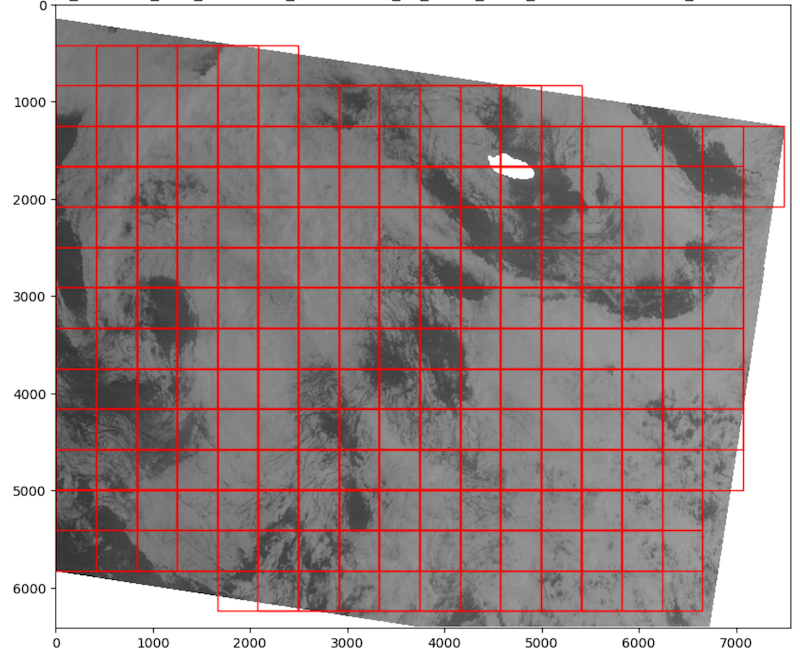

# SARSearch
SARSearch is a module and command-line tool designed for managing and processing Synthetic Aperture Radar (SAR) data 
via ASF's HyP3 service.

## Project Overview
**SARSearch** simplifies the process of submitting jobs, downloading results, and checking job statuses, and facilitating 
efficient SAR data analysis. It supports processing pre-downloaded zip files, applying landmasks to the downloaded 
SAR images, and generating tile maps from GeoTIFF files.

## Features
- **Job Submission**: Submit SAR processing jobs using a list of granule identifiers.
- **Job Monitoring**: Check the status of submitted jobs.
- **Result Downloading**: Download completed job files to a specified directory.
- **Flexible Configuration**: Use a YAML configuration file for settings.
- **Granule Management**: Manage granule lists via text file input.
- **Zip File Processing**: Extract and process SAR data from zip files.
- **Landmask Application**: Apply landmask to downloaded SAR images.
- **Tile Map Generation**: Generate a tile map from a directory of GeoTIFF files.
- **ASF Search and Download**: Search ASF and download frames based on search parameters.

## Installation
Clone the repository and install dependencies:

```bash
git clone https://github.com/yourgithub/sarsearch.git
cd sarsearch
pip install -r requirements.txt
```

## Configuration Setup
Modify the config.yaml to include your ASF HyP3 credentials and any default settings. Specify your 
granule list file path if not using the command line option.

## Using Commmand Line Interface
### Command Line Arguments:
```bash
    -h, --help: Show this help message and exit.
    -c, --config: Path to the YAML configuration file.
    -g, --granule-file: File path for a text file containing granule names.
    --submit: Submit jobs from the list of granules.
    --download: Download completed jobs.
    --status: Check the status of submitted jobs.
    --process_zip: Process zip files from ASF.
    --apply_landmask: Apply landmask to downloaded files.
    --tile_map: Generate a tile map from a directory of GeoTIFF files.
    --asf_hyp3: Interface with ASF hyp3. Search and download frames.
```

### Examples

### Submit Jobs:
```bash
    python sarsearch.py asf_hyp3 --config path/to/config.yaml --granule-file path/to/granules.txt --submit
```

### Check Job Status:
```bash
    python sarsearch.py asf_hyp3 --config path/to/config.yaml --status job_name
```

### Download Results:
```bash
    python sarsearch.py asf_hyp3 --config path/to/config.yaml --download /path/to/download_dir --job_name job_name
```

### Process Zip Files:
```bash
    python sarsearch.py process_zip --input_dir /path/to/zip_dir --output_dir /path/to/dest_dir --num_processes 4
```    

### Apply Landmask to Files:
```bash
    python sarsearch.py apply_landmask --input_dir /path/to/input_dir --output_dir /path/to/output_dir --landcover_tif /path/to/landcover.tif
```    
    
### Generate (Ocean) Tile Map:


Generate tile map functionality facilitates segmenting ocean areas into tiles. 
This creates a tile map from a directory of GeoTIFF SAR frames. User configurable tiles can be cut from the GeoTIFF 
images across ocean areas. Land areas are avoided through the use of `land_threshold` parameters.

Tile map generation requires a directory of GeoTIFF files. The tile size, land threshold, and stride can be adjusted. 
Random sampling can be enabled to generate a tile map with random samples. 
```bash
    python sarsearch.py tile_map --input_dir /path/to/geoTIFF_dir --output_file /path/to/tile_map.json --tile_size 500 --land_threshold 0.1 --stride 0.5 --random_sampling False --num_random_samples 1000
```    

## Dependencies

- Python 3.8+
- hyp3_sdk 
- PyYAML 
- rasterio
- numpy
- tqdm
- rtree
- psutil

Ensure all dependencies are installed using `pip install -r requirements.txt`

## Contributing
Contributors are welcome to propose enhancements or fix bugs. For major changes, 
please open an issue first to discuss what you would like to change.

1. Fork the repository. 
1. Create your feature branch (git checkout -b feature/fooBar).
1. Commit your changes (git commit -am 'Add some fooBar').
1. Push to the branch (git push origin feature/fooBar).
1. Open a new Pull Request.

## License
This project is licensed under the MIT License - see the LICENSE file for details.
